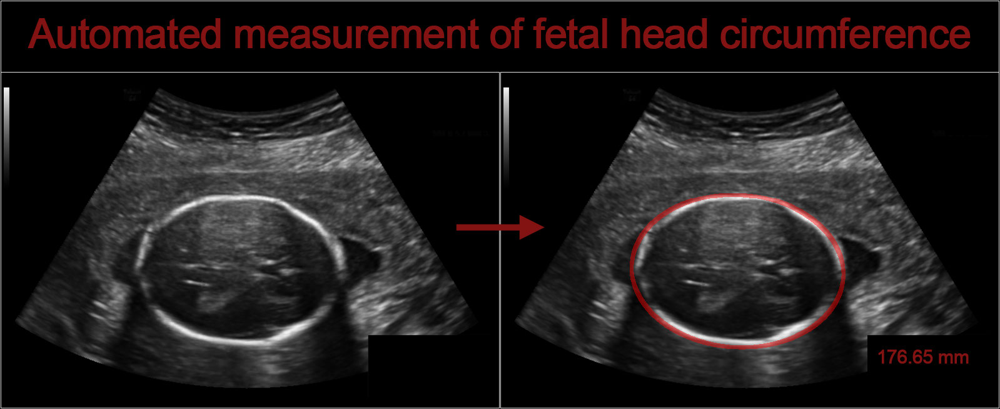
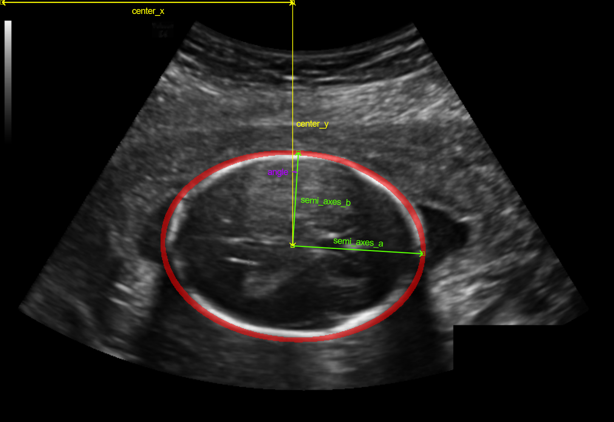
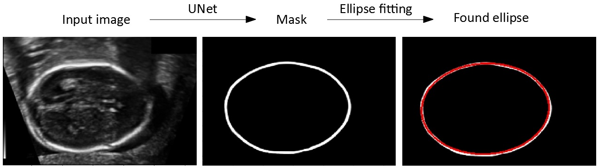
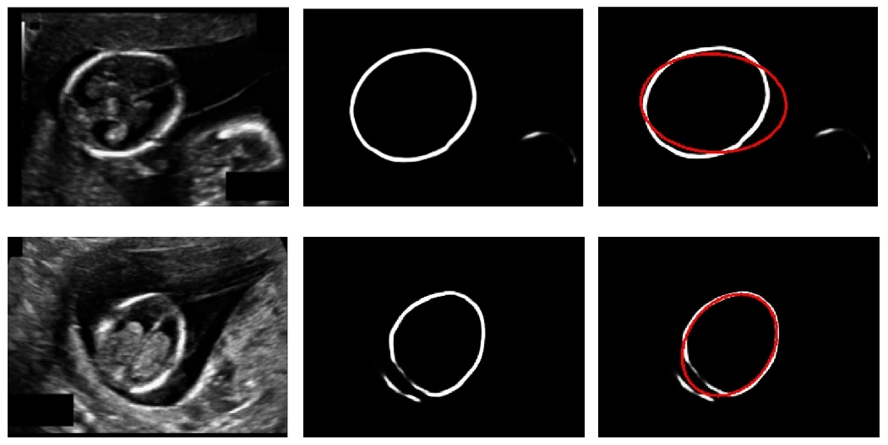

# ChallengeHC18

[Automated measurement of fetal head circumference](https://hc18.grand-challenge.org/)

## Challenge goals

During pregnancy, ultrasound imaging is used to measure fetal biometrics. One of these measurements is the fetal head circumference (HC).

The HC can be used to estimate the gestational age and monitor growth of the fetus. The HC is measured in a specific cross section of the fetal head, which is called the standard plane.

 This challenge makes it possible to compare developed algorithms for automated measurement of fetal head circumference in 2D ultrasound images.

## Data description

The dataset for this challenge contains a total of 1334 two-dimensional (2D) ultrasound images of the standard plane that can be used to measure the HC.

The data is divided into a training set of 999 images and a test set of 335 images. The size of each 2D ultrasound image is 800 by 540 pixels with a pixel size ranging from 0.052 to 0.326 mm.

The training set also includes an image with the manual annotation of the head circumference for each HC, which was made by a trained sonographer.

## Metric

The results should be submitted as a csv file which contains 6 columns and 336 rows. The first row should be:

**filename,center_x_mm,center_y_mm,semi_axes_a_mm,semi_axes_b_mm,angle_rad**

## Score updates

| Date  | Model                                       | LB score Mean abs difference (mm) ± std | Rank  (TOP %) | Solution                                                                             | weight_name                                                                   |
| ----- | ------------------------------------------- | ------------------------------------------ | ------------- | ------------------------------------------------------------------------------------ | ----------------------------------------------------------------------------- |
| 21/07 | First commit                                | x                                          | x             | x                                                                                    | x                                                                             |
| 25/07 | UNet Batchnorm                           | 5.99 ± 11.26                               | 554/848 (65%) | SGD 5 epochs no lr scheduling dice loss                                     | UNet1_loss=0.63_SGD_ep=5_(216, 320)                                           |
| 26/07 | UNet Batchnorm                           | 4.26 ± 7.58                                | 511/850 (60%) | SGD 25 epochs multistepLR dice loss                                         | UNet1_dice=0.4405_SGD_ep=29_(216, 320)_wd=0_dice_loss                         |
| 27/07 | UNet Batchnorm                           | 3.97 ± 6.97                                | 503/851 (59%) | SGD 35 epochs multistepLR dice loss data aug                             | UNet1_dice=0.438_SGD_ep=23_(216, 320)_wd=0_dice_loss                          |
| 27/07 | DilatedUNet Batchnorm                    | 2.65 ± 6.08                                | 402/852 (47%) | SGD 35 epochs multistepLR dice loss data aug                             | DilatedUNet_dice=0.477_SGD_ep=28_(216, 320)_wd=0_dice_loss                    |
| 27/07 | DilatedUNet Batchnorm                    | 2.42 ± 4.63                                | 373/853 (43%) | SGD 35 epochs multistepLR dice + WBCE loss data aug                      | DilatedUNet_dice=0.477_SGD_ep=24_(216, 320)_wd=0_bce_dice_loss                |
| 29/07 | DilatedUNet Batchnorm                    | 2.28 ± 3.53                                | 351/853 (41%) | SGD 35 epochs multistepLR dice + WBCE loss more data aug weight decay | DilatedUNet_dice=0.478_SGD_ep=28_(216, 320)_wd=0.0001_bce_dice_loss           |
| 01/08 | Custom UNet Dilation Deep supervision | 1.92 ± 2.33                                | 73/864 (8%)   | SGD 40 epochs multistepLR dice + WBCE loss data aug weight decay      | U_Net_dice=0.476_SGD_ep=30_(216, 320)_wd=0.0001_bce_dice_loss                 |
| 03/08 | Custom UNet Dilation Deep supervision | 1.91 ± 1.89                                | 72/876 (8%)   | SGD 60 epochs cosine annealing dice + WBCE loss data aug weight decay | U_Net_dice=0.483_SGD_ep=51_(216, 320)_wd=0.0001_bce_dice_loss_cosineannealing |

## Final solution

- Data preprocessing:
  - train/test/valid (80%/15%/5%)

- Architecture: unet + dilation in bottleneck + deep supervision

- Ellipse fitting: https://ieeexplore.ieee.org/document/546029/

- Training:
  - data aug: h/v flip, scale, shift
  - resize to (216, 320)
  - random weights
  - SGD
  - LR scheduler : MultiStepLR
  - 1e-4 weight decay
  - Loss : BCE + DICE

## What didn't work

- Focal loss
- Tversky loss
- Adam/AdamW (converges fast but not as good as SGD)
- Nested UNet (UNet++)
- Attention Unet
- Multi input

## Things I would have liked to try

- TTA
- Other architectures (maskrcnn, deeplabv3+, etc.)
- different input sizes
- weights from pretrained autoencoder
- other algorithms for ellipse fitting
- ensemble

## Fails

